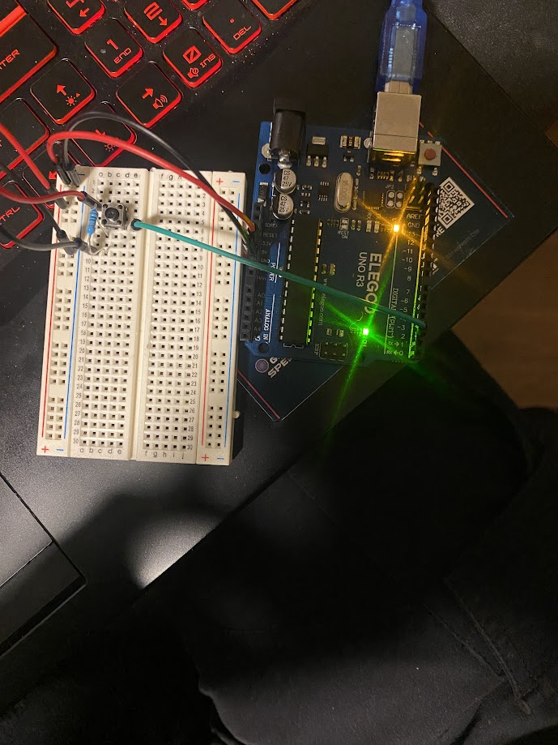

# Arduino Button Counter

This project is a simple Arduino sketch that increments a counter each time a button is pressed and displays the value in the **Serial Monitor**. It's a great beginner project to get familiar with digital input reading and serial communication.

## 📸 Project Image

 <!-- Replace with your actual image filename -->

## 🛠️ Hardware Required

- Arduino Uno (or compatible board)  
- Pushbutton  
- 10kΩ pull-down resistor (optional depending on setup)  
- Breadboard and jumper wires  
- USB cable for programming

## 🧠 How It Works

- The button is connected to digital pin `2`.  
- When pressed, the pin reads `HIGH`, and the counter is incremented.  
- The value is then printed to the Serial Monitor.
- `lastBtnState` is used to avoid multiple counts from a single press (debouncing).

> Note: This code can be improved with more reliable debouncing logic, such as tracking the press state across loops or using a debounce library.

## 💻 Arduino Code

```
const int pushButtonPin = 2;

void setup() {
  pinMode(pushButtonPin, INPUT);
  Serial.begin(9600);
}

void loop() {
  int lastBtnState = LOW;
  int buttonState = digitalRead(pushButtonPin);
  int i = 0;

  if (buttonState == HIGH && lastBtnState == LOW) {
    Serial.println(i);
    delay(1);
    i++;
  }

  lastBtnState = buttonState;
  delay(50);
}
